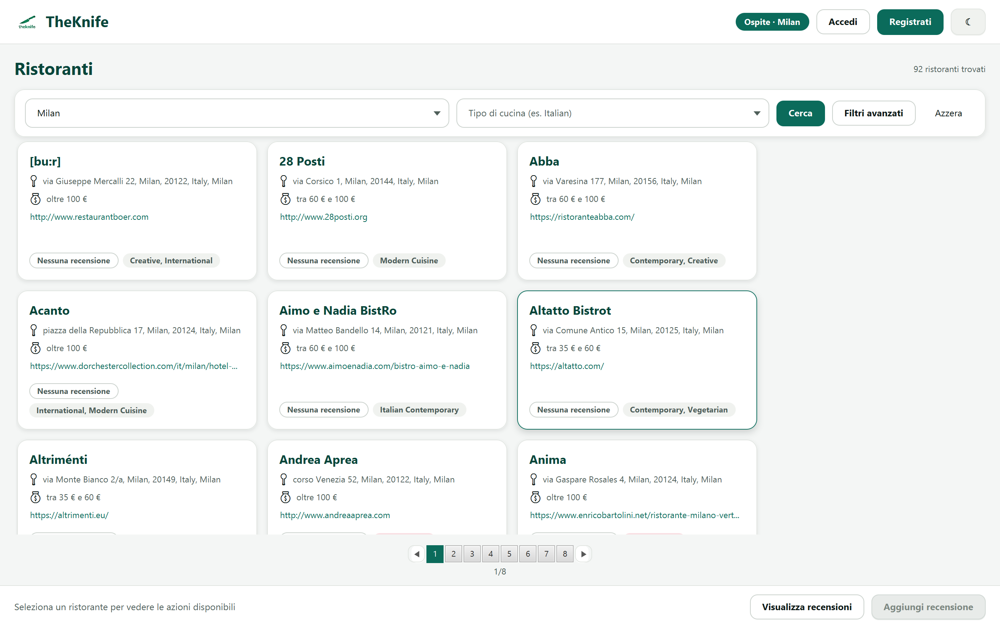
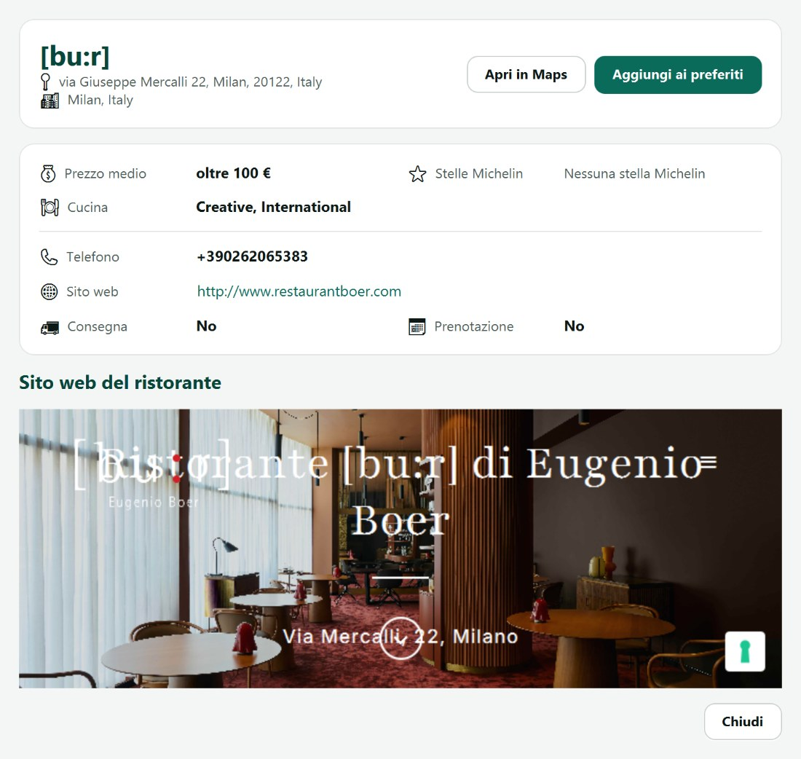
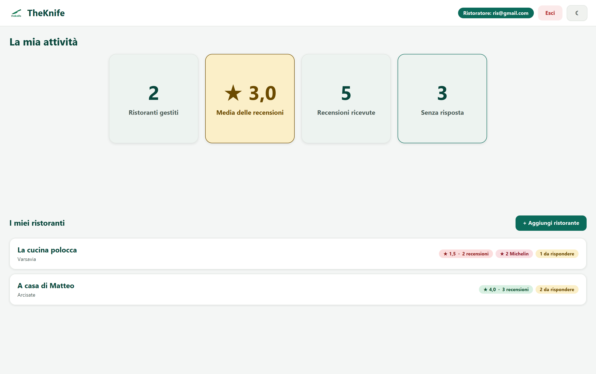
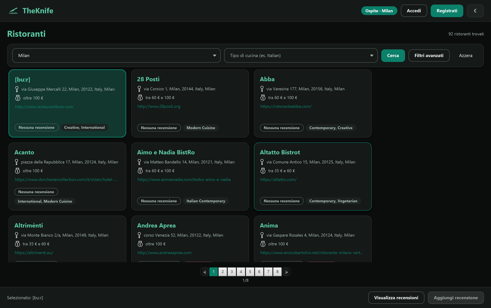
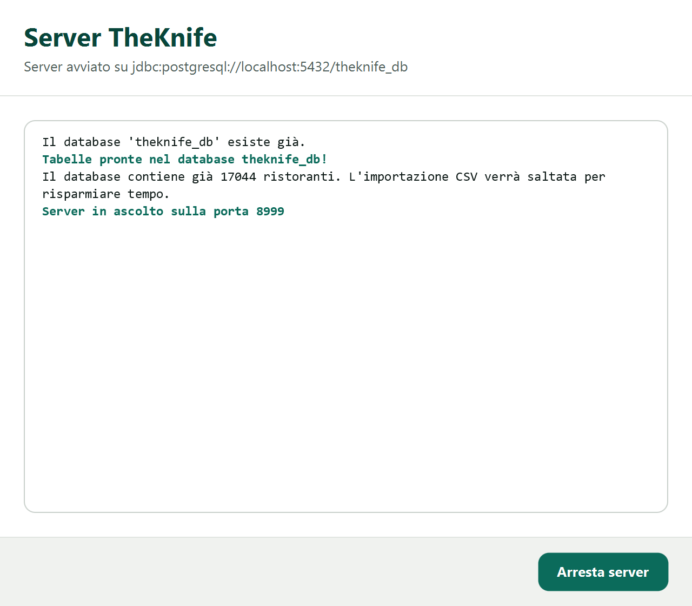

<div align="center">


# TheKnife

**Trova, recensisci e gestisci ristoranti.**

Applicazione desktop client/server realizzata per il corso di Laboratorio Interdisciplinare B<br>
Università degli Studi dell'Insubria — sede di Varese


</div>

---

## Indice

- [Panoramica](#panoramica)
- [Funzionalità](#funzionalità)
- [Anteprima](#anteprima)
- [Architettura](#architettura)
- [Requisiti](#requisiti)
- [Installazione](#installazione)
- [Esecuzione](#esecuzione)
- [Struttura del repository](#struttura-del-repository)
- [Documentazione](#documentazione)
- [Autori](#autori)

---

## Panoramica

TheKnife è una piattaforma che permette di cercare ristoranti in tutto il mondo e di filtrarli per
città, tipo di cucina, fascia di prezzo, valutazione media, consegna a domicilio e prenotazione in
linea. I clienti registrati possono salvare i preferiti e scrivere recensioni; i ristoratori
inseriscono i propri locali, seguono l'andamento delle valutazioni e rispondono ai giudizi ricevuti.

Il catalogo di partenza è quello della Guida Michelin: circa 17.700 ristoranti, importati
automaticamente in un database PostgreSQL al primo avvio del server.

<div align="center">
  
</div>

## Funzionalità

| | Ospite | Cliente | Ristoratore |
|---|:---:|:---:|:---:|
| Ricerca per città e filtri avanzati | X | X | X |
| Scheda del ristorante e sito web integrato | X | X | X |
| Lettura delle recensioni | X | X | X |
| Preferiti | — | X | — |
| Scrittura, modifica ed eliminazione delle recensioni | — | X | — |
| Inserimento di nuovi ristoranti | — | — | X |
| Riepilogo dell'attività e risposta alle recensioni | — | — | X |

Il ruolo viene scelto in fase di registrazione ed è esclusivo. L'interfaccia è disponibile in tema
chiaro e in tema scuro, con i contrasti verificati secondo le linee guida WCAG.

## Anteprima

| Scheda del ristorante | Riepilogo del ristoratore |
|---|---|
|  |  |
| **Tema scuro** | **Finestra del server** |
|  |  |

## Architettura

Il progetto è un applicativo Maven multi-modulo diviso in tre parti:

| Modulo | Ruolo |
|---|---|
| `clientTK` | Interfaccia grafica JavaFX: viste FXML, controller, gestione della sessione e del tema |
| `serverTK` | Server multi-thread: protocollo su socket, DAO JDBC, creazione dello schema e importazione dei dati |
| `commonTK` | DTO serializzabili scambiati fra i due lati e regole di validazione condivise |


## Requisiti

| Componente | Versione |
|---|---|
| Java (JRE o JDK) | **da 21 a 25** — la 21 è la versione di riferimento |
| PostgreSQL | 12 o successiva (collaudato sulla 18) |
| Sistema operativo | Windows 10/11, macOS, Linux |
| Memoria | almeno 256 MB liberi |

> **Importante.**
> Non utilizzare Java 26 o versioni successive: il componente `WebView` di JavaFX, usato per mostrare
> il sito dei ristoranti, richiede il modulo `jdk.jsobject` che da Java 26 non esiste più e
> l'applicazione non si avvia.

## Installazione

### Pacchetto già compilato

1. Scaricare ed estrarre l'archivio `.zip` distribuito dagli autori.
2. Verificare che nella cartella `bin/` siano presenti gli archivi per il proprio sistema:
   `serverTK-4.0.jar` e `clientTK-4.0.jar` per Windows,
   `serverTK-4.0-mac-aarch64.jar` e `clientTK-4.0-mac-aarch64.jar` per macOS.
3. Assicurarsi che il servizio PostgreSQL sia in esecuzione.

> **Nota per macOS.** Gli archivi con il suffisso `-mac-aarch64` contengono le librerie native di
> JavaFX in formato `.dylib` e girano sui Mac con Apple Silicon. Per un Mac con processore Intel
> si rigenerano con `./mvnw package -Djavafx.platform=mac`.

### Compilazione dal sorgente

```bash
git clone https://github.com/sonoFrangu/theknife.git
cd theknife
./mvnw package
```

I due archivi eseguibili vengono creati in `bin/serverTK-4.0.jar` e
`bin/clientTK-4.0.jar`. Su Windows si usa `mvnw.cmd` al posto di `./mvnw`.

## Esecuzione

Il **server va sempre avviato per primo**: il client, all'apertura, chiede al server l'elenco delle
città e senza di esso non è in grado di mostrare alcun dato.

### Avvio rapido

Gli script nella cartella principale chiedono quante finestre dell'applicazione aprire (da 1 a 5,
una se si preme invio), avviano il server, attendono che sia in ascolto e aprono da soli i client.

| Sistema | Comando |
|---|---|
| Windows | doppio clic su `avvioWindows.bat` |
| macOS e Linux | `chmod +x avvioMacOS.command` (una sola volta), poi doppio clic su `avvioMacOS.command` |

Gli script cercano gli archivi prima in `bin/`, poi nelle cartelle `target/` prodotte dalla
compilazione: funzionano quindi sia con il pacchetto distribuito sia con il progetto appena
compilato.

### Avvio manuale

```bash
# 1. server: si apre la finestra di configurazione del database
java -jar bin/serverTK-4.0.jar          # su macOS: bin/serverTK-4.0-mac-aarch64.jar

# 2. dopo che il registro riporta "Server in ascolto sulla porta 8999"
java -jar bin/clientTK-4.0.jar          # su macOS: bin/clientTK-4.0-mac-aarch64.jar
```

Su Windows si può usare `javaw -jar` per non lasciare aperta la finestra del terminale.

### Primo avvio

Nella finestra del server vanno indicati indirizzo, porta, utente e password di PostgreSQL; i campi
sono già compilati con i valori più comuni (`localhost`, `5432`, `postgres`). Alla prima esecuzione
il server crea da solo il database `theknife_db`, genera le tabelle e importa il catalogo: questa
fase può richiedere qualche minuto. Gli avvii successivi riconoscono che i dati ci sono già e sono
immediati.

## Struttura del repository

```
theknife/
├── clientTK/        applicazione JavaFX (viste FXML, controller, foglio di stile)
├── serverTK/        server socket, DAO, migrazioni Flyway e importazione dei dati
├── commonTK/        DTO condivisi fra client e server
├── bin/             archivi eseguibili del pacchetto distribuito
├── doc/             manuali in PDF, diagrammi UML ed ER, Javadoc
├── avvioWindows.bat
├── avvioMacOS.command
└── pom.xml          POM padre del progetto multi-modulo
```

## Documentazione

- **Manuale Utente** e **Manuale Tecnico** in formato PDF nella cartella [`doc/`](doc)
- **Javadoc** dei tre moduli in [`doc/javadoc`](doc/javadoc), rigenerabile con:

  ```bash
  ./mvnw javadoc:aggregate
  ```

- Diagramma ER e diagrammi UML nella cartella [`doc/`](doc)

## Autori

| Autore | Matricola | Sede |
|---|---|---|
| Matteo Franguelli | 761133 | Varese |
| Elia Toschi | 760873 | Varese |
| Celestino Resteghini | 760865 | Varese |
| Michele Viselli | 763016 | Varese |
